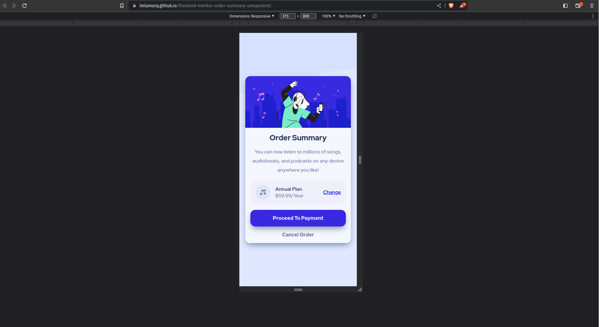
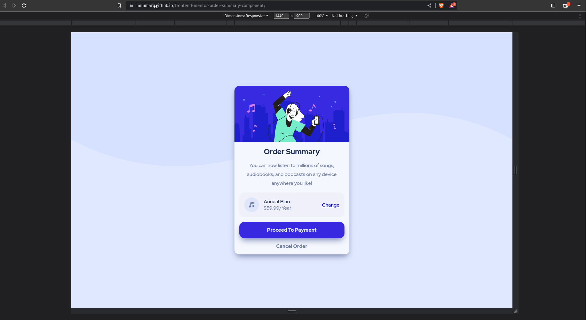
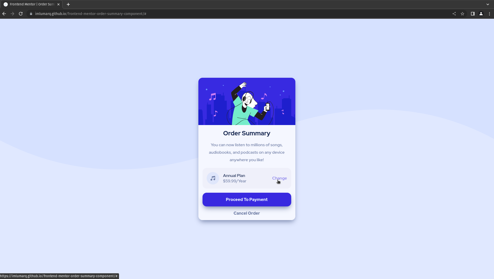
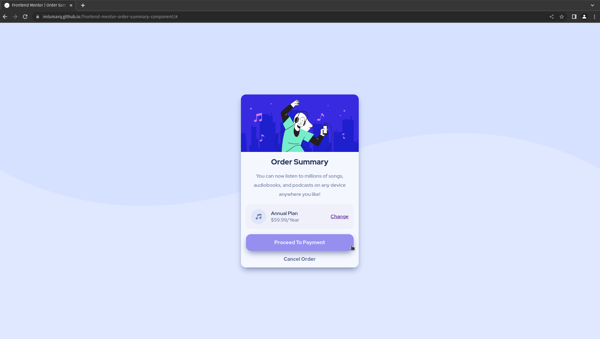
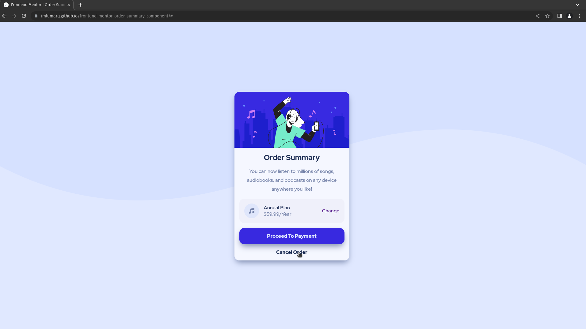
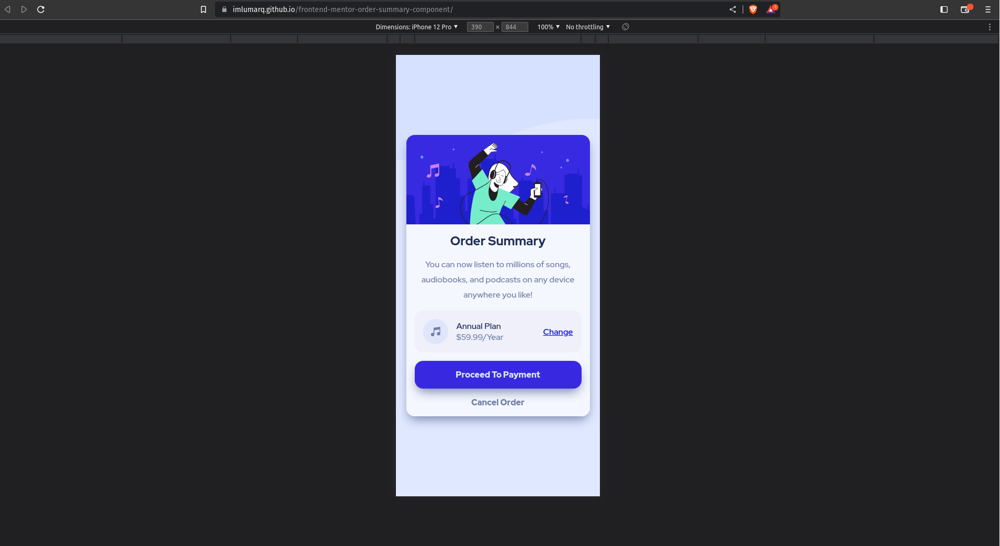
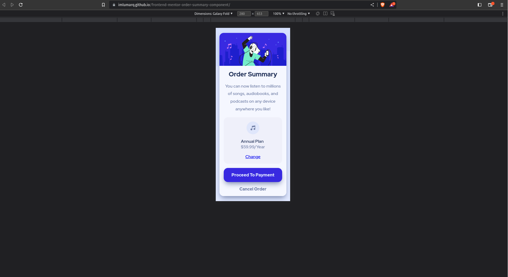
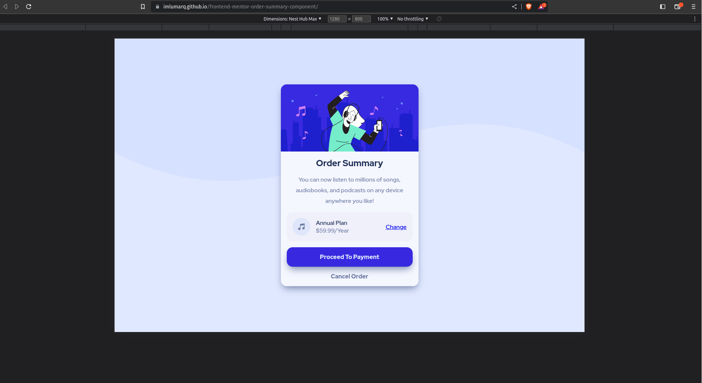

# Frontend Mentor - Order summary card solution

This is a solution to the [Order summary card challenge on Frontend Mentor](https://www.frontendmentor.io/challenges/order-summary-component-QlPmajDUj). Frontend Mentor challenges help you improve your coding skills by building realistic projects.

## Table of contents

- [Overview](#overview)
  - [The challenge](#the-challenge)
  - [Screenshot](#screenshot)
  - [Links](#links)
- [My process](#my-process)
  - [Built with](#built-with)
- [Acknowledgments](#acknowledgments)

**Note: Delete this note and update the table of contents based on what sections you keep.**

## Overview

### The challenge

Users should be able to:

- See hover states for interactive elements

### Screenshot

### Links

- Solution URL: 
- Live Site URL: 
- Github Repository: 

## My process

### Built with

- CSS custom properties
- Semantic tags
- Flexbox
- CSS Grid
- Mobile-first workflow

## Author

- Frontend Mentor - [@imLumarq](https://www.frontendmentor.io/profile/imLumarq)
